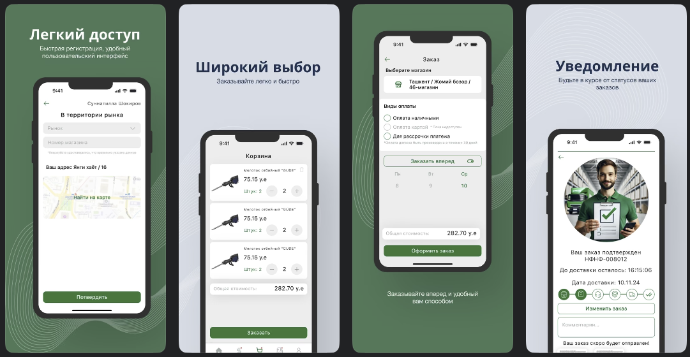

# 📱 Preview

  

# 🏪 Onur Market

**Onur Market** is a Flutter-based mobile application developed for the **Onur Group**.  
It provides users with a **convenient and secure** way to shop online, make payments, manage orders, and access a variety of services — all in one platform.

---

## ✨ Features

- 🛒 **Online Shopping** – Browse and purchase a wide range of products and services.  
- 💳 **Quick Payments** – Pay effortlessly using cash, card, or installment options.  
- 📦 **Order Management** – Track your orders, delivery status, and history.  
- 🧑‍💼 **Service Management** – Manage services for supervisors, agents, and deliveries.  
- 🎁 **Bonuses & Cashback** – Earn bonuses and cashback with every purchase.  
- 💬 **Customer Support** – Get help anytime from a responsive support team.  
- 📰 **Latest Offers** – Stay updated with the newest deals and product updates.
- 📰 **Role based** –  3 different modules: Supervisor & Agent & Client.   

---

## 🔗 Download Links

- 📱 [**Play Store**](https://play.google.com/store/apps/details?id=uz.sectorsoft.onuragent&pcampaignid=web_share)  
- 🍎 [**App Store**](https://apps.apple.com/uz/app/onur-group/id6738658032)

---

## 🛠️ Tech Stack

- **Flutter** – Cross-platform UI framework  
- **Dart** – Main programming language  
- **REST API** – Backend communication  
- **Riverpod & Provider** – State management  
- **Firebase** – Push notifications  
- **Yandex AppMetrica** – Analytics & user statistics  

---

## 👨‍💻 About

Developed by **Abduazim Abduqahhorov**, Flutter Developer (Onur Group).  
📍 Uzbekistan | ✉️ [abdukhaxxoroff@gmail.com](mailto:abdukhaxxoroff@gmail.com)
